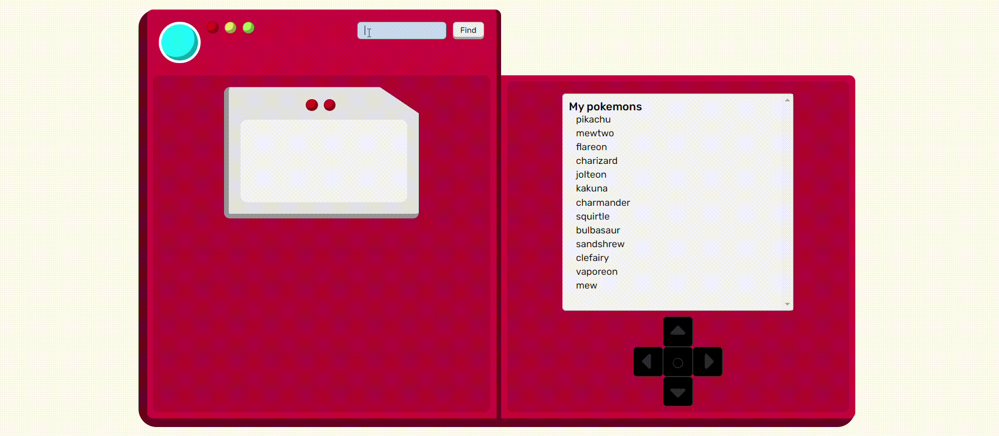

# Vue Pokedex

Web app that allows to search for a Pokemon through the PokeAPI, to view the details of the Pokemon found and to catch it in your own Pokedex.

## Istallation

In order to access the code, go to my GitHub at the following link: https://github.com/BeatriceRocchi/vue-pokedex.
Now clone the repository, open it in your IDE and install all the dependencies and run by running the development server:

```bash
npm install
npm run dev
```

To have more information on the PokéApi, read the official documentation at the following link: https://pokeapi.co/docs/v2.

## Description



The layout of the web app is inspired by the pokédex of the original Pokémon cartoon. The layout is composed of two main components:

1. **Pokémon search and information**

   The left part of the pokédex has an upper section in which you can type the name of the pokémon you want to search and get info about. After the click on the 'find' button, all the information about the pokemon are collected through an API call to PokeAPI and displayed in the lower section. In details, for each pokémon there are the following data:

   - animated images of the pokémon
   - name
   - type
   - height
   - weight
   - stats about certain aspects of battles. In particular, for each aspect there is the value of the base stat, which grows as they gain levels and can be altered momentarily by effects in battles

   After the search of a pokémon, a green 'catch' button with a pokéball will appears under the searchbar and the 'find' button. If the pokémon is already caught and it is in the pokédex, the button has a different style: yellow and with the text 'free'.

2. **My pokémon list**
   The right part of the pokédex contains the list of all pokémon that have been caught. By clicking on a pokémon of the list, its data are displayed in the section on the left. The up and down arrows in the button below also allow to easily move between the pokémons list.

   Thanks to a functionality implemented through the LocalStorage, the pokémon list is maintained even after the web page is closed.
